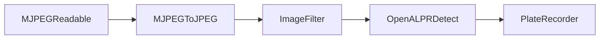

# Plate Minder #

Monitor an MJPEG stream for license plates and record them.

Currently RTSP & video files can be converted to an MJPEG stream. See the `config.yaml` example below.

This project is a proof of concept.

Short term goals:

 * Provide better support for hardware accelleration
 * Provide MQTT support for recording found plates

 ## Components ##

 Plate minder consists of extensible and loosely coupled components.



`MJPEGReadable` converts a video source to MJPEG. 
- `RTSPMJPEGReadable` converts an RTSP stream into an MJPEG stream.
- `FileMJPEGReadable` converts a video file from disk into an MJPEG stream.

`MJPEGToJPEG` extracts JPEG images from an MJPEG stream.

`ImageFilter` performs pre-processing of images.
- `MaskImageFilter` masks out polygon shapes from an image.
- `MotionImageFilter` crops an image to the largest area of detected motion.

`OpenALPRDetect` sends JPEG images to an open-alpr-http-wrapper service and captures detected license plate information.

`PlateRecorder` stores/transmits captured license plate information.
- `SQLitePlateRecorder` stores captured license plate data in a SQLite database.

## Installation ##

Docker Compose:

```yaml
version: "3.9"
services:
  plate-minder:
    container_name: plate-minder
    restart: unless-stopped
    image: sclaflin/plate-minder:latest
    volumes:
      - ./data:/app/data
      - ./config.yaml:/app/config.yaml
  open-alpr-http-wrapper:
    container_name: open-alpr-http-wrapper
    restart: unless-stopped
    image: sclaflin/open-alpr-http-wrapper:latest
```

config.yaml:

```yaml
capture:
  # How often an image should be captured. 
  # Increments are in seconds. Fractional values can be used for sub-second capturing.
  captureInterval: 1

  # Have an RTSP stream? Uncomment and enter the URL for your RTSP camera.
  # type: rtsp
  # url: 'rtsp://<your camera>'

  # Have a video file you want to process? Uncomment and enter the path of your video
  # type: file
  # file: ./<path to your video file>

# Filter jpeg frames. Currently 'motion' and 'mask' filters are available.
# Filters are processed in the order they are defined
filters:
  # Masks out a portion of the frame. Note that any pixels within the mask
  # cannot be used for detection.
  - type: mask
    # Optional. Outputs an image to the './data' path
    # debug: true
    shapes:
      # Shapes are a series of x/y coordinates
      - 1267,0,1920,0,1920,100,1267,100 # Timestamp, top right
  # Crops the frame down to the largest area of motion detection
  - type: motion
    # Optional. Outputs an image to the './data' path
    # debug: true
  
openALPR:
  # Path to ALPRToHTTP server
  url: http://open-alpr-http-wrapper:3000/detect

# Record detected license plate information
recorders:
  # Output to a SQLite database
  - type: sqlite
```

## Usage ##

Open the database for reading. ;-)