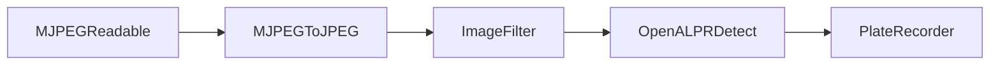

# Plate Minder #

[GitHub](https://github.com/sclaflin/Plate-Minder) | [Docker
Hub](https://hub.docker.com/r/sclaflin/plate-minder)

***Please note: This project is in a very early stage of development. The API is
currently very unstable and not suitable for anyone that's not into tinkering as
things evolve.***

Monitor an MJPEG stream for license plates and record them.

Currently RTSP & video files can be converted to an MJPEG stream. See the
`config.yaml` example below.

Short term goals:

 * Provide better support for hardware accelleration
 * ~~Provide MQTT support for recording found plates~~
 * ~~Provide original image and not just the ROI~~
 * ~~Draw an ROI box in original image~~
 * ~~Multiple camera support~~
 * ~~Customizable base topic~~
 * ~~Use home assistant autodiscovery~~
 * ~~Storage of images where plates have been detected.~~
	* ~~Customizable & tokenized file names.~~
 * ~~Web UI for configuration~~
   * ~~Add RESTful API to manage configuration~~


 ## Components ##

 Plate minder consists of extensible and loosely coupled components.



`MJPEGReadable` converts a video source to MJPEG. 
- `RTSPMJPEGReadable` converts an RTSP stream into an MJPEG stream.
- `FileMJPEGReadable` converts a video file from disk into an MJPEG stream.

`MJPEGToJPEG` extracts JPEG images from an MJPEG stream.

`ImageFilter` performs pre-processing of images.
- `MaskImageFilter` masks out polygon shapes from an image.
- `MotionImageFilter` crops an image to the largest area of detected motion.

`OpenALPRDetect` sends JPEG images to an open-alpr-http-wrapper service and
captures detected license plate information.

`PlateRecorder` stores/transmits captured license plate information.
- `SQLitePlateRecorder` stores captured license plate data in a SQLite database.
- `MQTTPlateRecorder` sends captured license plate date to an MQTT broker.
- `FilePlateRecorder` stores captured license plate images to disk.

## Installation ##

**Getting Started**

The following steps assume you're installing & configuring Plate-Minder all on
the same machine.

0. Install [docker](https://docs.docker.com/engine/install/) & [docker-compose](https://docs.docker.com/compose/install/)
1. [Download](https://github.com/sclaflin/Plate-Minder/blob/master/examples/basic-install.zip)
   and extract the bare-bones configuration.
2. Within the 'plate-minder' folder, run
   ```
   docker-compose up -d
   ```
3. From the same computer, navigate to http://localhost:8080
4. Enter your RTSP sources, filters, and recorders.
5. Captured images & data will be placed in the `./data` folder.

Read on if you'd like to configure it further.
### docker-compose.yaml: ###

Plate-Minder minimally consists of two services: plate-minder &
open-alpr-http-wrapper. Optionally, a plate-minder-web service can be used to
help with setting up plate-minder. Below is an example docker-compose.yaml.

```yaml
version: "3.9"
services:
  plate-minder:
    container_name: plate-minder
    restart: unless-stopped
    image: sclaflin/plate-minder:latest
    ports:
      - 4000:4000
    volumes:
      # Set's the docker container to the host container local time
      - /etc/localtime:/etc/localtime:ro
      - ./data:/app/data
      - ./config.yaml:/app/config.yaml
  open-alpr-http-wrapper:
    container_name: open-alpr-http-wrapper
    restart: unless-stopped
    image: sclaflin/open-alpr-http-wrapper:latest
  # This service is not required, but exists to help with configuration. Once 
  # Plate-Minder has been configured, feel free to disable this service.
  plate-minder-web:
    container_name: plate-minder-web
    image: sclaflin/plate-minder-web:latest
    restart: unless-stopped
    # The default configuration assumes docker is running on the same machine 
    # you're viewing the web UI with. If you're accessing the service from a
    # different computer, you should set the PLATE_MINDER_URL to whatever host 
    # & port Plate-Minder's RESTful service is accessible from.
    environment:
      - PLATE_MINDER_URL=http://localhost:4000
    ports:
      - 8080:80
```

### config.yaml ###

Configuration of Plate-Minder itself is handled through config.yaml.  Minimally,
this can be an empty file if you intend to configure it via the plate-minder-web
service. Below is a complete config.yaml example:

```yaml
sources:
  # Have an RTSP stream?
  - type: rtsp
    name: Northbound
    url: 'rtsp://<your camera>'
    # How often an image should be captured. 
    # Increments are in seconds. Fractional values (i.e. "0.5") can be used for
    # sub-second capturing.
    captureInterval: 1
  # Have a video file you want to process?
  - type: file
    name: Southbound
    file: ./<path to your video file>
    captureInterval: 1

# Globally applied filters
# Filter jpeg frames. Currently 'motion' and 'mask' filters are available.
# Filters are processed in the order they are defined
filters:
  # Masks out a portion of the frame. Note that any pixels within the mask
  # cannot be used for detection.
  - type: mask
    # Optional. Outputs an image to the './data' path
    # debug: true
    shapes:
      # Shapes are a series of x/y coordinates
      - 1267,0,1920,0,1920,100,1267,100 # Timestamp, top right
  # Crops the frame down to the largest area of motion detection
  - type: motion
    # Optional. Outputs an image to the './data' path
    # debug: true
  
openALPR:
  # Path to ALPRToHTTP server
  url: http://open-alpr-http-wrapper:3000/detect

# Record detected license plate information
recorders:
  # Output to a SQLite database
  - type: sqlite
  # Output to an MQTT host
  - type: mqtt
    url: <URL to your MQTT instance>
    # Optional - Default base topic is 'plate-minder'
    baseTopic: plate-minder
    # Optional - Home Assistant Auto Discovery support.
    hassDiscovery:
      enable: true
      discoveryPrefix: homeassistant
    # Connection options can be found here: 
    # https://github.com/mqttjs/MQTT.js#client
    mqttOptions:
      username: username
      password: mypassword
  # Output files to a folder
  - type: file
    # Naming pattern of files to store.
    # Tokens ({{DATE}}, {{TIME}}, {{SOURCE}}, and {{PLATE}}) are replaced with
    # dynamic values.
    pattern: './data/images/{{DATE}}/{{SOURCE}}/{{TIME}}_{{PLATE}}.jpeg'
    # Files older than retainDays will be removed.
    retainDays: 30

# RESTful service to alter this yaml file. Please note that this service
# will end up stripping out the comments.
restService:
  # Defaults to true
  enable: true
  # Port # for the service to run on.
  port: 4000
```

## Usage ##

### SQLite ###

Enabling the sqlite recorder will save the detected plate information into a
SQLite database file (`./data/database.db`). Reporting & analytics queries can
be run against it.


### MQTT ###

Enabling the MQTT recorder will publish detected plate information to the
`plate-minder` base topic. The following subtopics are available:

`plate-minder/detect` contains a JSON string containing the most recent
detection info:

```json
{
  "epoch_time": 1640031280937,
  "results": [
    {
      "plate": "ABC123",
      "confidence": 89.232658,
      "matches_template": 0,
      "plate_index": 0,
      "region": "",
      "region_confidence": 0,
      "processing_time_ms": 18.699596,
      "requested_topn": 10,
      "coordinates": [
        {
          "x": 510,
          "y": 516
        },
        {
          "x": 698,
          "y": 516
        },
        {
          "x": 698,
          "y": 611
        },
        {
          "x": 508,
          "y": 611
        }
      ],
      "candidates": [
        {
          "plate": "ABC123",
          "confidence": 89.232658,
          "matches_template": 0
        }
      ]
    }
  ]
}
```
`plate-minder/<source name>/plate` contains the most recently detected plate
number.

`plate-minder/<source name>/image` contains a JPEG image of the most recently
detected plate number.

`plate-minder/<source name>/roi` contains a cropped JPEG image of the region of
interest where the plate was detected.

### File ###

Enabling the file recorder will store images with a plate detected to disk. A
customizable dynamic file path is used to keep the images organized.

Given:

1. a source name of "Southbound"
2. a date of "2021-12-25", a time of "1:30:27.123PM"
3. a detected plate number of "ABC123"
4. a file pattern of
   `./data/images/{{DATE}}/{{SOURCE}}/{{TIME}}_{{PLATE}}.jpeg`

The resulting file path would be:

`./data/images/2021_12_25/Southbound/13_13_27_123_ABC123.jpeg`

`retainDays` Sets the number of days images should be kept. After expiring,
images and their folders will be removed automatically.


### Home Assistant ###

Assuming Plate-Minder is sending data to your MQTT broker, the following entites
should be auto-discovered per video source:

*Please note that entities will not appear until the first license plate has
been detected.*

* `sensor.<Source Name>_plate`
* `camera.<Source Name>_image`
* `camera.<Source Name>_roi`

Picture entity card & entities card examples:


## Hardware Acceleration ##

### Intel Quicksync ###

1. Add the `/dev/dri/renderD128` device to your `docker-compose.yaml` file.
    ```yaml
    plate-minder:
      ...
	  devices:
        # For Intel related hardware acceleration
        - /dev/dri/renderD128
    ```
2. Determine the group that `/dev/dri/renderD128` belongs to:
    ```bash
    $ ls -l /dev/dri/renderD128 
    crw-rw----+ 1 root render 226, 128 Jan 24 23:03 /dev/dri/renderD128
    ```
   In the above case, the device belongs to the "render" group.
3. Get the group id:
    ```bash
    $ getent group render 
    render:x:107:
    ```
   In the above case, the group id is "107".
4. Set the group id that the docker container user will run as.
    ```yaml
    plate-minder:
      ...
	  # For Intel related hardware acceleration, the container needs the same
      # group id as /dev/dri/renderD128.
	  user: 1000:107
    ```
5. Set `preInputArgs` and `preOutputArgs` for each video source you have set in
   your `config.yaml`:
    ```yaml
    sources:
      ...
      - type: rtsp
        ...
	    # FFMPEG arguments to apply before the input argument. This can be used for
	    # several things. In this example, we are leveraging Intel's QuickSync for
	    # hardware decoding of an h264 stream. Please note that in order for this
	    # example to work, you've got a few more steps. Please see the Hardware 
	    # Acceleration section further down.
        preInputArgs:
          - -hwaccel
          - qsv
          - -c:v
          - h264_qsv
	    # FFMPEG arguments to apply before the output argument. This can be used for
	    # several things. In this example, we are leveraging Intel's Quicksync for
	    # hardware encoding of the MJPEG stream. Please note that in order for this
	    # example to work, you've got a few more steps. Please see the Hardware 
	    # Acceleration section further down.
        preOutputArgs:
          - -c:v
          - mjpeg_qsv
    ```

### Nvidia NVENC ###

TODO: Find a kind soul with the appropriate hardware willing to work this out.

### AMD ###

TODO: Find a kind soul with the appropriate hardware willing to work this out.
## Common Problems ##

> The web UI is just an empty page.

Plate Minder's web UI is written against the latest versions of web-browsers.
Please update your browser and try again.

> The web UI loads, but there's an error dialog that says "Failed to fetch".

The most likely reasons are:

  * You are trying to view the web UI from a different computer and didn't update
  the `PLATE_MINDER_URL` environment variable in your docker-compose.yaml file.
  * The plate-minder service isn't running.
  * Your feet stink.
  * Two of these reasons are inappropriate.

## Thanks ##

This project has been a pleasure to develop due largely to standing on the
shoulders of giants.

* [Docker](https://www.docker.com/)
* [FFMPEG](https://ffmpeg.org/)
* [jellyfin-ffmpeg](https://github.com/jellyfin/jellyfin-ffmpeg)
* [Git](https://git-scm.com/)
* [MQTT.js](https://github.com/mqttjs)
* [node.js](https://nodejs.org)
* [node-sqlite](https://github.com/kriasoft/node-sqlite)
* [node-sqlite3](https://github.com/mapbox/node-sqlite3/)
* [npm](https://www.npmjs.com/)
* [OpenALPR](https://github.com/openalpr/openalpr)
* [OpenCV](https://opencv.org/)
* [Sharp](https://github.com/lovell/sharp)
* [VSCode](https://code.visualstudio.com/)
